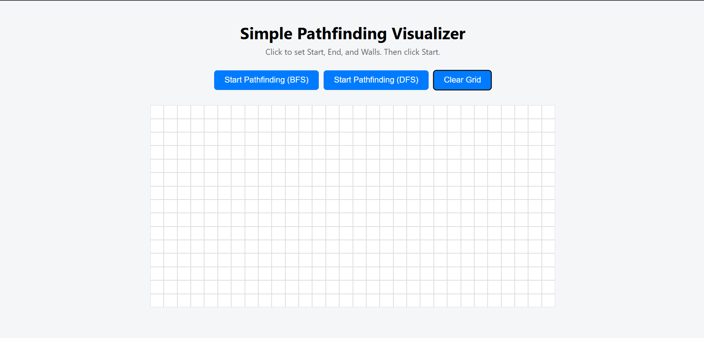
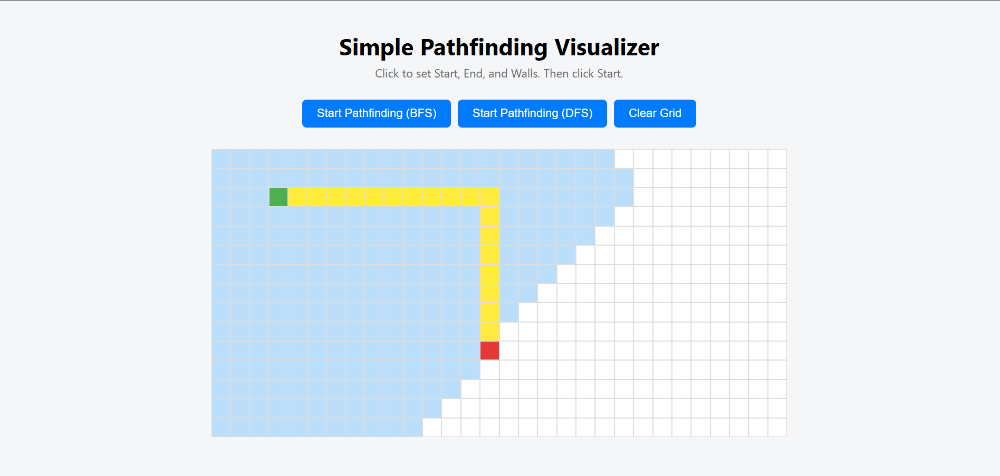
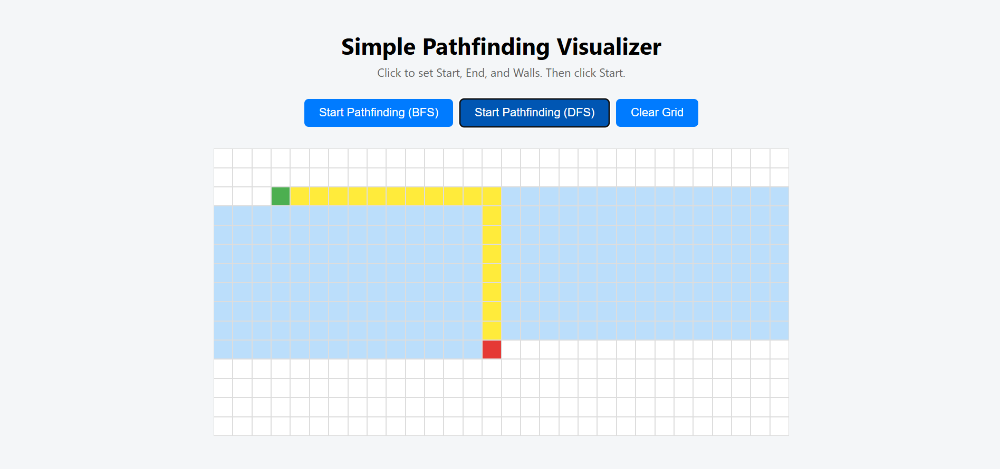

Path Visualizer
A simple React-based pathfinding visualizer built to demonstrate basic algorithms and grid traversal.

🚀 Features
Grid-based interface
Interactive path selection
Basic visualization of algorithms (like BFS, DFS)
📸 Screenshots

### 🏠 grid Page

### 📊 using bfs

### 📈 using dfs

🛠️ Tech Stack
React
HTML/CSS
JavaScript
🧪 Getting Started
Prerequisites
Node.js and npm installed
Installation
git clone https://github.com/yourusername/path-visualizer.git
cd path-visualizer
npm install
npm start

📂 Folder Structure

path-visualizer/
├── public/
├── src/
│   ├── App.js
│   ├── App.css
│   └── index.js
├── package.json
└── README.md
🙌 Contributing
Feel free to fork the repo and create a pull request.

📄 License
This project is open-source and available under the MIT License.

---